# SilverBullet44ビルドガイド

## 材料

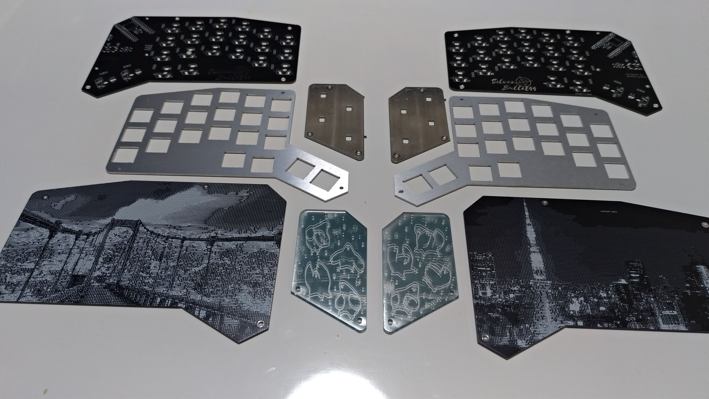
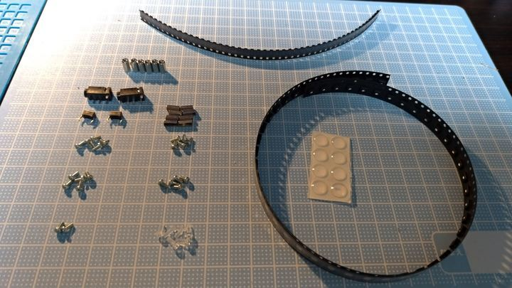

### 材料リスト

| 品目                    | 数量 | 備考 |
| :---------------------- | ---: | :--- |
| PCB                     |  2枚 |  |
| トッププレート          |  2枚 |  |
| ボトムプレート          |  2枚 |  |
| アクリルミラープレート  |  2枚 |  |
| ProMicro                |  2個 |  |
| ダイオード              | 44個 | スピーカーを使う場合45個。<br>スルーホールは使えないので注意。 |
| LED(SK6812mini)         | 44個 | 保護プレートを光らせる場合52個。 |
| Kailhソケット           | 44個 |  |
| M2L4ネジ                | 22本 |  |
| M2L7六角スペーサ        |  8本 |  |
| M2L8丸スペーサ          |  6本 |  |
| M2L5PCネジ              |  6本 |  |
| TRRS JACK               |  2個 |  |
| タクトスイッチ          |  2個 |  |
| ゴム足                  |  8個 |  |
| MX互換スイッチ          | 44個 |  |
| 1Uキーキャップ          | 38個 |  |
| 1.25Uキーキャップ       |  2個 |  |
| 1.5Uキーキャップ        |  4個 |  |
| TRRSまたはTRSケーブル   |  1本 |  |
| USBケーブル             |  1本 |  |

### オプション品

| 品目             | 数量 | 備考 |
| :--------------- | ---: | :--- |
| コンスルー       |  4本 |  |
| 光る保護プレート |  2枚 | オプション |
| 圧電サウンダ     |  1個 | スピーカーオプション<br>型番: PKMCS0909E4000-R1 |
| 1kΩ抵抗         |  1個 | スピーカーオプション |


## 組み立て手順

### LED

LEDをはんだ付けします。  
シルクで白く囲ってあるのが一番大きいパッドです。  
温度調整はんだごてで220度くらいに設定してください。もたついてると壊れます。

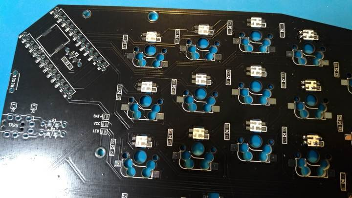
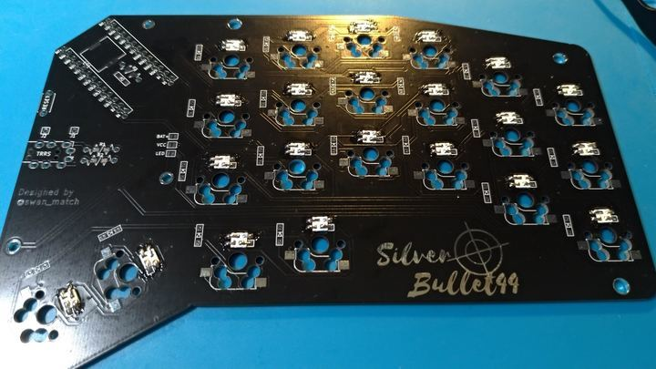

### ダイオード
ダイオードをはんだ付けします。  
向きに気をつけてください。  
表面実装の場合うっすら線が書いてあるほうが上です。  
先に予備ハンダとしてどちらかのパッドにハンダを盛って、
予備ハンダを溶かすようにしてダイオードの片足をはんだ付けします。  
この状態で横から見てダイオードが浮いていないことを確認してください。  
浮いてしまっている場合はダイオードをピンセットで押さえつけながら、
はんだづけした部分を再度熱すればきれいになります。
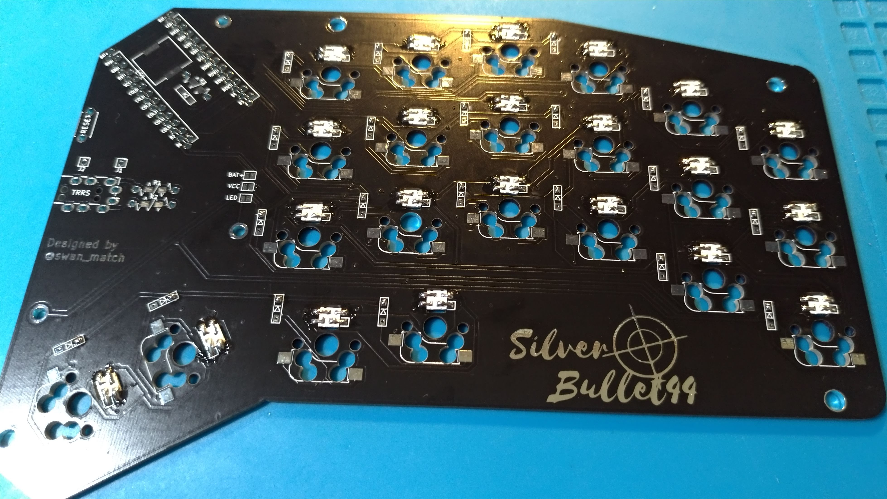

浮いていないことを確認し、反対側をはんだ付けします。

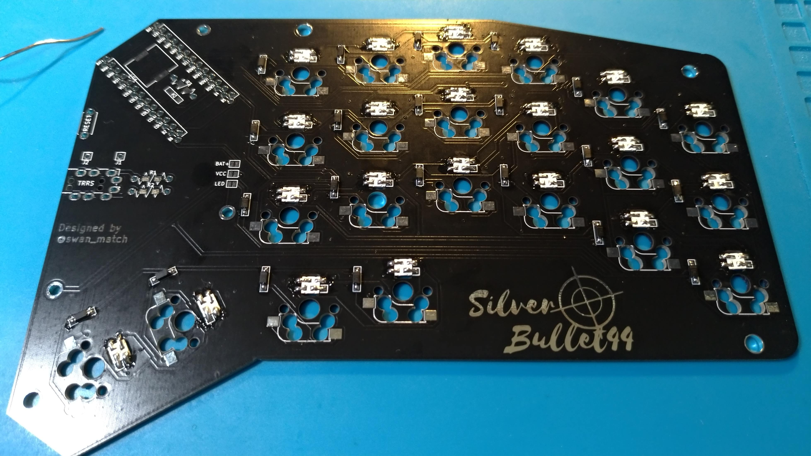

### ソケット
ソケットをはんだ付けします。
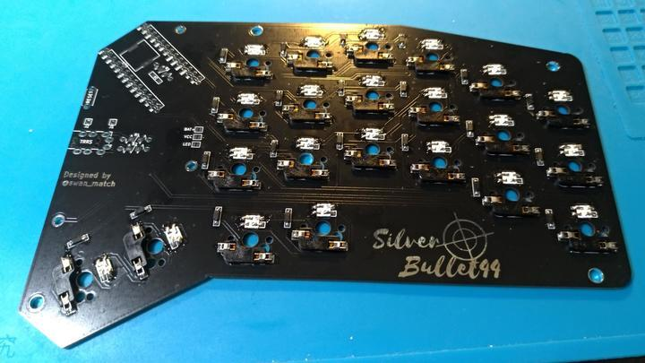

### TRRS、リセットスイッチ
反対側(表、スイッチ側)にひっくり返して、
TRRS JACKとタクトスイッチを差し込み、
再度裏面に戻してはんだ付けします。
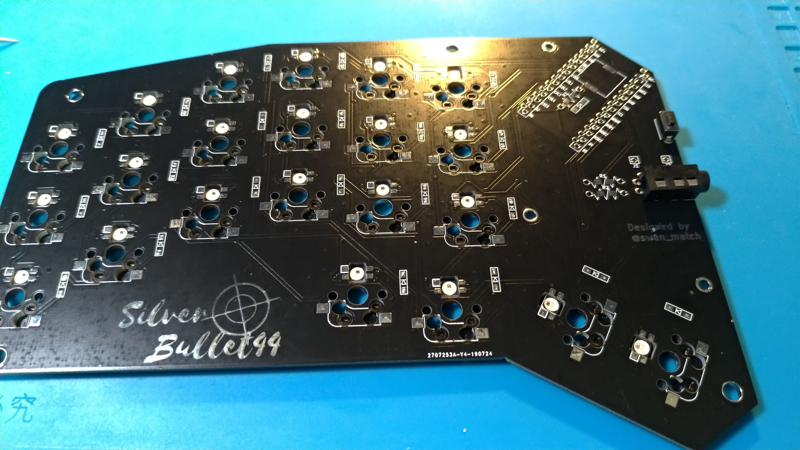

### 光る保護プレート(オプション)
保護プレートを光らせる場合、
基板のVCCとLEDの２つをジャンパします。
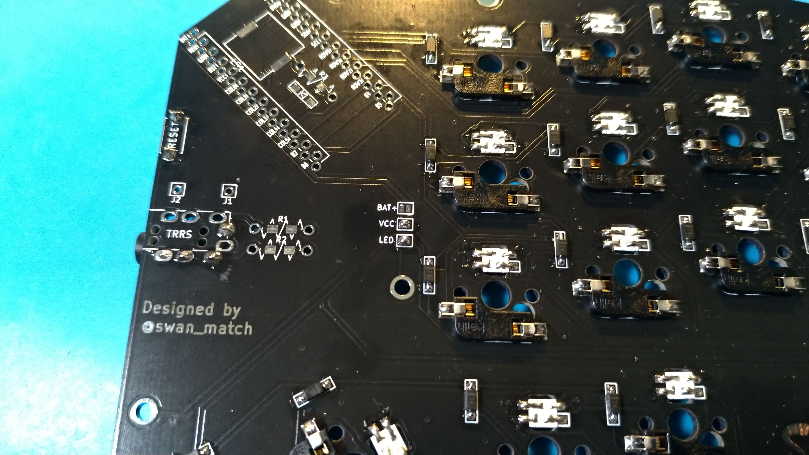

保護プレートも本体と同様に、LEDをハンダ付けます
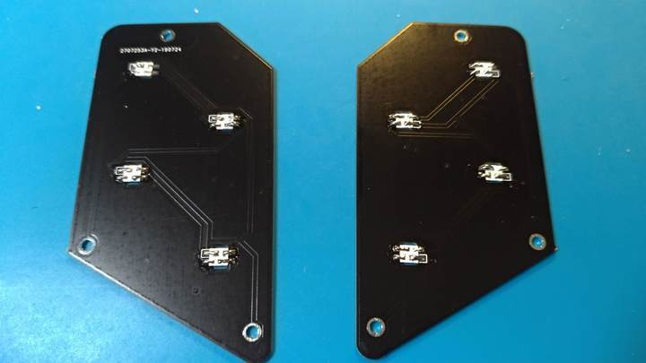

### 圧電サウンダ(オプション)
1kΩ抵抗、ダイオード、圧電サウンダをはんだ付けします。

### ProMicro
ここだけは間違えるとリカバリが面倒なので、**細心の注意**をして作業にあたってください  
コンスルーを使う場合はHelixなどのビルドガイドを参考にしてください。  
また、ProMicroはあらかじめいわゆる「モゲ対策」をしておくといいです。

表面にひっくり返して四角く囲ってあるところに付属のピンヘッダを指します。
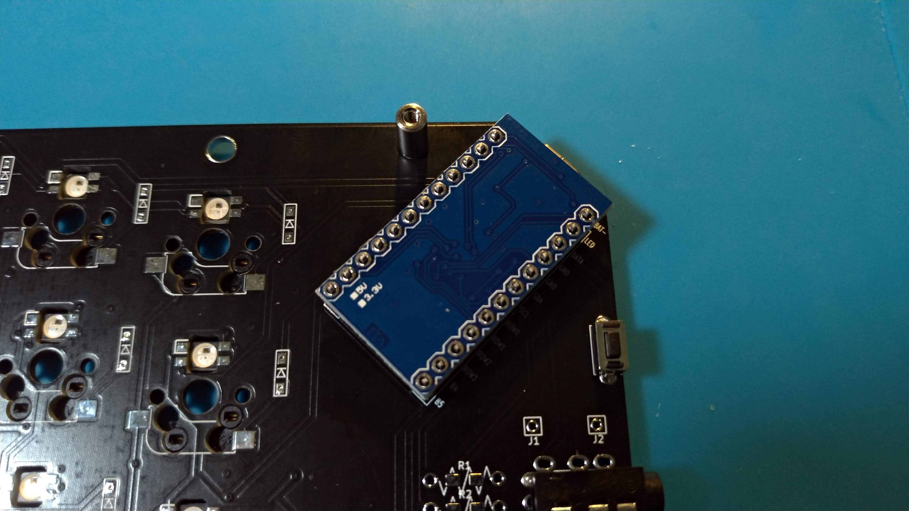
まず4角のピンをはんだ付けし、
ピンヘッダとプロマイクロが浮いていないことを確認して、
他のピンをはんだ付けします。  
浮いてしまっていた場合、やけどに気を付けて、指で少し抑えながら、
浮いているピンにハンダをあてます。
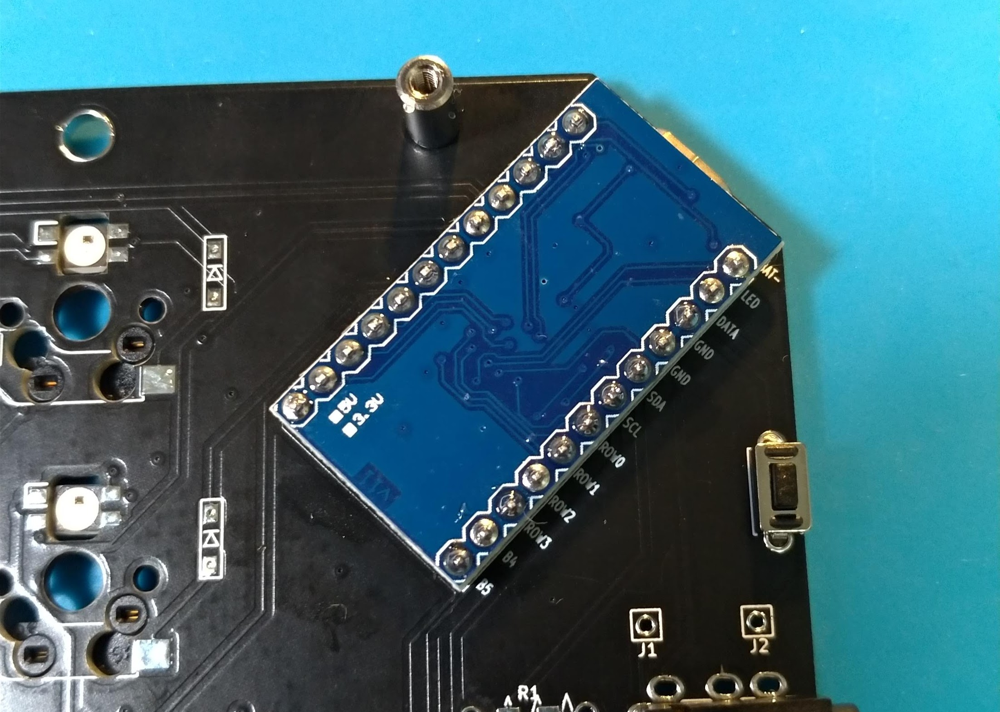

裏面に戻し、表面と同様に4角からはんだ付けしていきます。
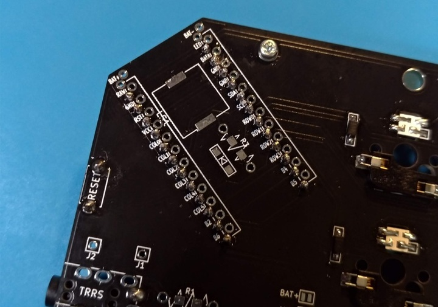

### OLED保護プレート
PCB裏側から丸スペーサーをネジ止めして、
表側に保護プレートを挟み込む形でPCネジで止めます。

保護プレートを光らせる場合、ミラーアクリルの下に回路基板を重ねて挟み込みます。
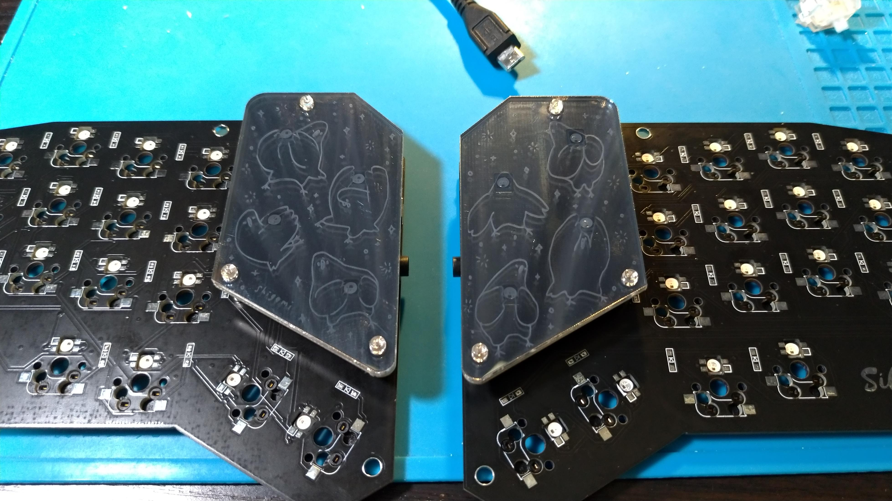
この段階で一度後述のファームウェアの書き込みをして導通テストしておくといいです。  
問題なければ全LEDが点灯するはずです。
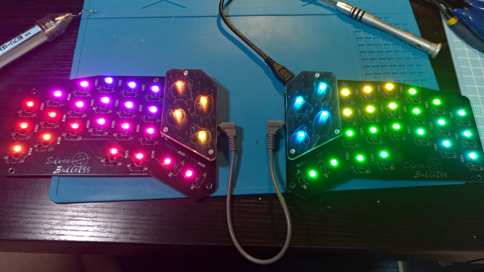

LEDの順番は下記のとおりです。
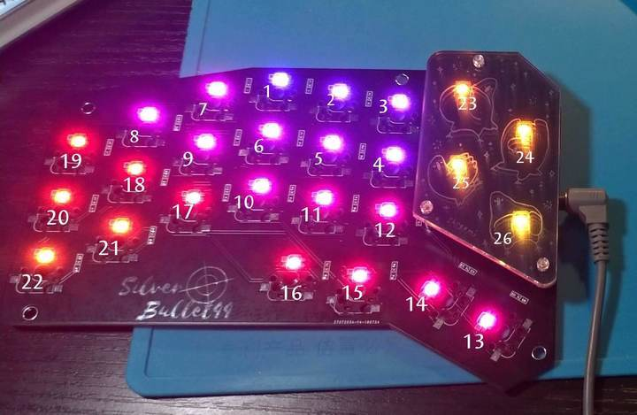

### スイッチ
トッププレートにスイッチをはめて、PCBに刺します。  
これも最初に4角からはめるといいです。
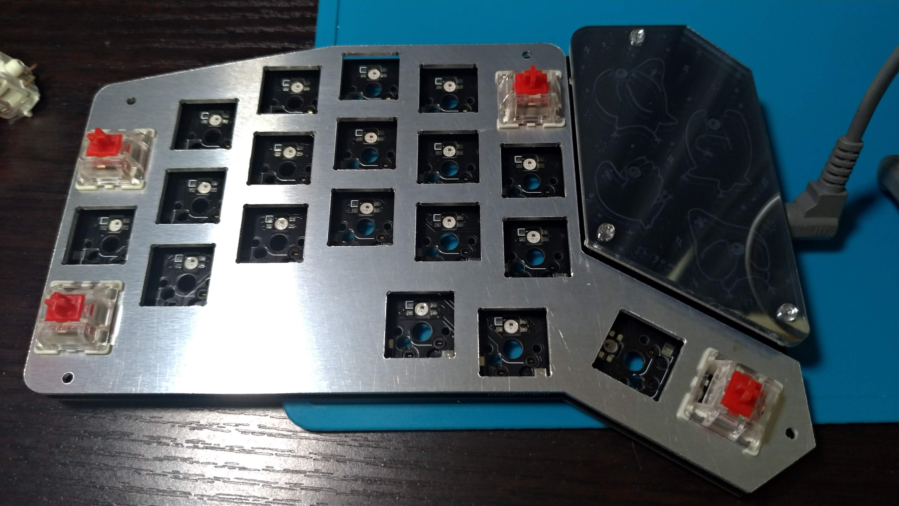
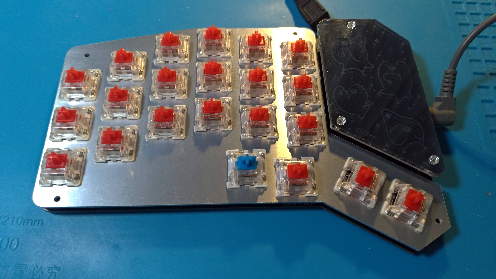

### プレート
ボトムプレートに六角スペーサーをネジ止めして、
本体にはめ込み、ネジ止めします。
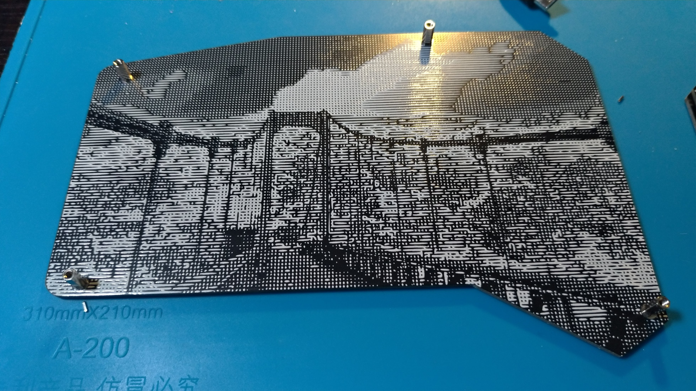
ボトムプレートにゴム足を貼り付けてください。

反対側も同様に組み立てます。

### ファームウェア
ファームウェアの書き込みは以下のコマンドを叩きます。  
QMKの環境構築についてはお使いのOSによって異なりなりますので、
公式ドキュメントを読んでください。
```sh
git clone https://github.com/swanmatch/qmk_firmware.git
cd qmk_firmware
make silverbullet44:default:avrdude
```

## 完成図
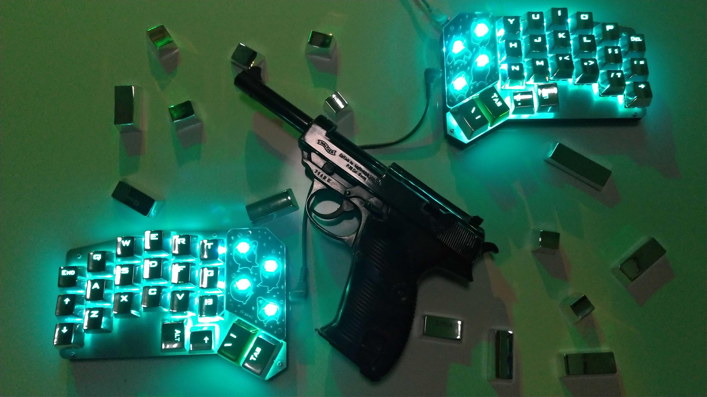