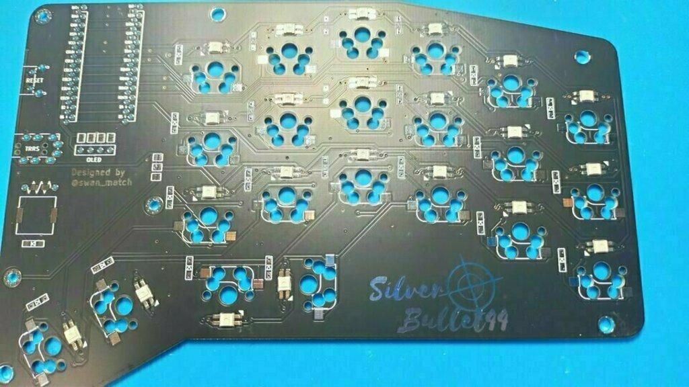
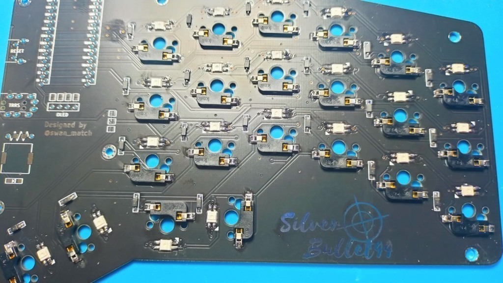
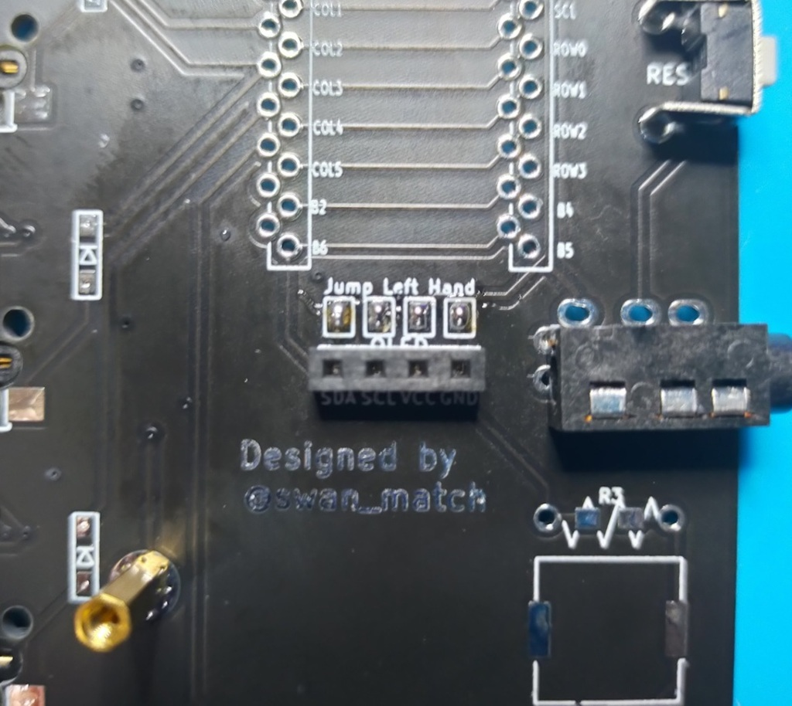
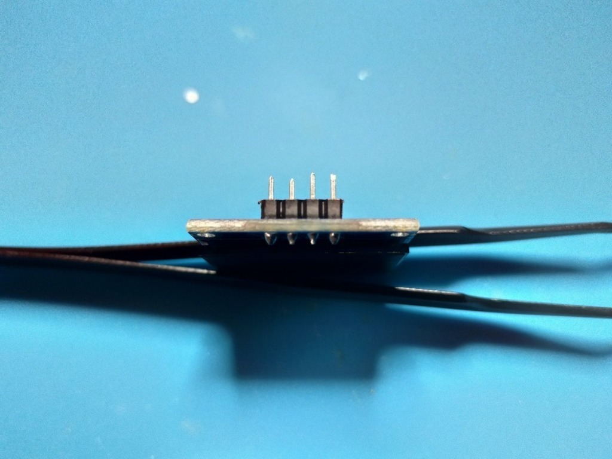
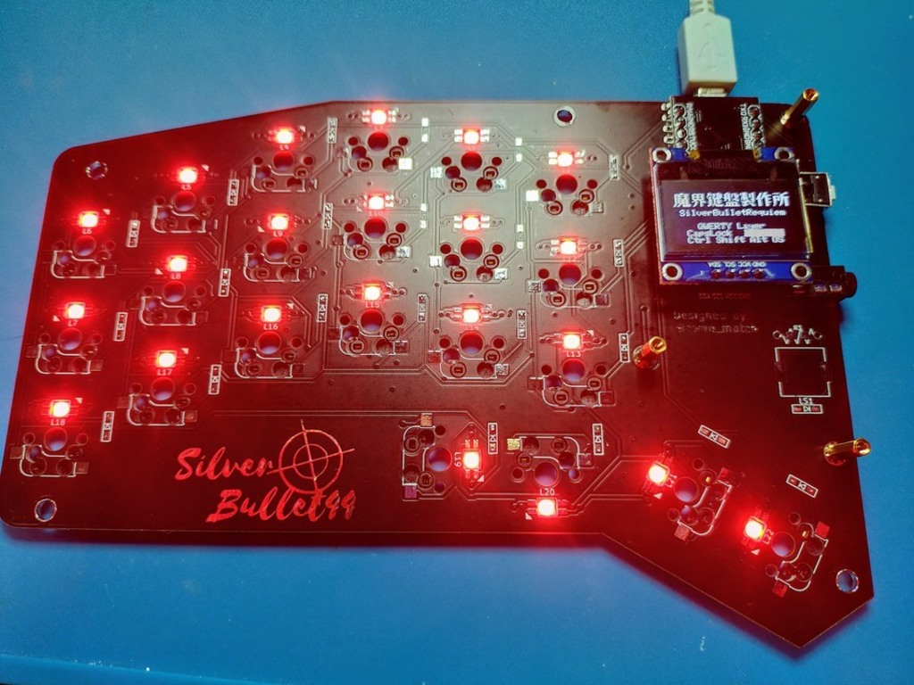

# SilverBulletRequiemビルドガイド

## 材料

<!--
-->


| 品目                    | 数量 | 備考 |
| :---------------------- | ---: | :--- |
| PCB                     |  2枚 |  |
| トッププレート          |  2枚 |  |
| アクリル保護プレート    |  2枚 |  |
| PCB保護プレート         |  2枚 |  |
| ProMicro                |  2個 |  |
| コンスルー              |  4本 |  |
| ダイオード              | 44個 |  |
| LED(SK6812mini)         | 44個 | 保護プレートを光らせる場合52個。 |
| OLEDディスプレイ        |  2個 |  |
| 1x4ピンソケット         |  2個 |  |
| Kailhソケット           | 44個 |  |
| M2L8丸スペーサ          |  6本 |  |
| M2L4ネジ                | 22本 |  |
| M2L5皿ネジ              |  6本 |  |
| TRRS JACK               |  2個 |  |
| タクトスイッチ          |  2個 |  |
| ゴム足                  |  8個 |  |
| MX互換スイッチ          | 44個 |  |
| 1Uキーキャップ          | 38個 |  |
| 1.25Uキーキャップ       |  2個 |  |
| 1.5Uキーキャップ        |  4個 |  |
| TRRSまたはTRSケーブル   |  1本 |  |
| USBケーブル             |  1本 |  |

### サンドイッチ

| 品目                    | 数量 | 備考 |
| :---------------------- | ---: | :--- |
| M2L7六角スペーサ        |  8本 |  |
| ボトムプレート          |  2枚 |  |

### アルミ削り出し

| 品目                    | 数量 | 備考 |
| :---------------------- | ---: | :--- |
| アッパーケース          |  2個 |  |
| ボトムケース            |  2個 |  |

### オプション品

| 品目             | 数量 | 備考 |
| :--------------- | ---: | :--- |
| EVAファーム      |  2枚 |  |
| バランスウェイト |  4個 |  |


## 組み立て手順

### LED

LEDをはんだ付けします。  
三角のシルクマークが付いているパッドがLEDの欠けている足に対応しています。  



### ダイオード

ダイオードをはんだ付けします。  
向きに気をつけてください。  
表面実装の場合うっすら線が書いてあるほうが上です。  
先に予備ハンダとしてどちらかのパッドにハンダを盛って、
予備ハンダを溶かすようにしてダイオードの片足をはんだ付けします。  


### ソケット

ソケットをはんだ付けします。



### TRRS、リセットスイッチ

反対側(表、スイッチ側)にひっくり返して、
TRRS JACKとタクトスイッチを差し込み、
再度裏面に戻してはんだ付けします。


### 光る保護プレート(オプション)

保護プレートを光らせる場合、
基板のVCCとLEDの２つをジャンパします。


保護プレートも本体と同様に、LEDをハンダ付けます


### ProMicro

ここだけは間違えるとリカバリが面倒なので、**細心の注意**をして作業にあたってください  
コンスルーの取り付け方は[遊舎工房さんの記事](https://yushakobo.zendesk.com/hc/ja/articles/360044233974-%E3%82%B3%E3%83%B3%E3%82%B9%E3%83%AB%E3%83%BC-%E3%82%B9%E3%83%97%E3%83%AA%E3%83%B3%E3%82%B0%E3%83%94%E3%83%B3%E3%83%98%E3%83%83%E3%83%80-%E3%81%AE%E5%8F%96%E3%82%8A%E4%BB%98%E3%81%91%E6%96%B9%E3%82%92%E6%95%99%E3%81%88%E3%81%A6%E4%B8%8B%E3%81%95%E3%81%84)を参考にしてください。  
また、ProMicroはあらかじめいわゆる[「モゲ対策」](https://scrapbox.io/self-made-kbds-ja/%E3%82%82%E3%81%92%E4%BA%88%E9%98%B2)をしておくといいです。

表面にひっくり返して四角く囲ってある枠に指し込みます。


### OLED

**表面**のOLED用のジャンパーをブリッジします。



表面からピンソケットを差し込み、**ウラ面**からはんだ付けします。  
少し浮きやすいのでマスキングテープを使うのがオススメです。


OLEDのピンヘッダを3mmになるように切ってください。



OLEDのウラ面部品とプロマイクロとの距離がギリギリなので、
OLEDかプロマイクロのどちらかにカプトンテープを貼って絶縁するようにしてください。  
(なければとりあえずOLEDのディスプレイがわについている保護シールを裏に貼ってください。)

この段階で一度後述の[ファームウェアの書き込み](#ファームウェア)をして導通テストしておくといいです。  
問題なければ全LEDが点灯するはずです。



### 保護プレート

丸スペーサをPCBとネジ止めし、上にPCB保護プレート、アクリル保護プレートを重ねてさらにネジ止めします。  
もしキーキャップをはめて干渉する場合は、少し斜め上に力をかけながらネジを締めてください。  
(大丈夫だと思いますが、それでも鑑賞する場合は少しヤスりがけしてください。)

### トッププレート

トッププレートにスイッチをはめて、PCBに刺します。  
フォームをお持ちの場合はトッププレートとPCBの間に挟みます。

### ケースの組み立て

#### トップマウントケースの場合

トッププレートをアッパーケースにネジ止めします。  
ウェイトをお持ちの場合はボトムケースにウェイトを貼ります。  
ボトムケースをアッパーケースにネジ止めします。

#### サンドイッチケースの場合

トッププレートとボトムプレートを六角スペーサでネジ止めします。
### ファームウェア

ファームウェアの書き込みは以下のコマンドを叩きます。  
QMKの環境構築についてはお使いのOSによって異なりなりますので、
公式ドキュメントを読んでください。

```sh
git clone https://github.com/swanmatch/qmk_firmware.git
cd qmk_firmware
make git-submodule
make silverbullet44/requiem:default:avrdude
# via対応する場合
make silverbullet44/requiem/via:default:avrdude
```

各種コンパイル済みのファームウェアも[こちら](https://github.com/swanmatch/silverbullet44/releases/tag/requiem)に置いておきます。  
書き込みは[QMK toolbox](https://github.com/qmk/qmk_toolbox/releases)を使うといいです。

VIA対応のファームウェアを書き込んだ場合、[Remap](https://remap-keys.app/)にアクセスすることで、動的にキーマップを変更できます。

## 完成図


